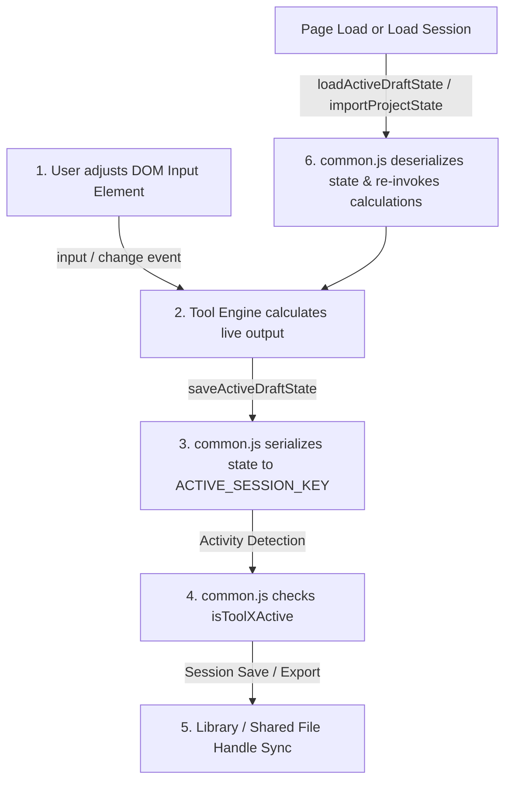

# Implementation Guidelines & Architecture Standard
## Mechanical System Calculations Suite (Commercial Engineering Edition)
**Current Version:** `v4.46` | **Target Users:** Estimators & Mechanical Engineers | **Scope:** Commercial Mechanical & Plumbing Design

---

## 1. Executive Summary & Architecture Philosophy

The **Mechanical System Calculations Suite** is an engineering calculation platform designed for commercial mechanical estimators and engineers. It provides sizing, hydraulic analysis, acoustic inspection, and code compliance checks across plumbing, hydronics, storm drainage, HVAC ductwork, and fuel gas systems.

### 1.1 Core Architectural Principles

1. **Zero-Build, Serverless-First Portability**
   - The application does **not** use Node.js build pipelines, bundlers (Webpack/Vite), TypeScript compilation, or frontend frameworks (React/Vue/Angular).
   - All modules must be runnable directly from standard file systems (`file:///` protocol) or network shared drives, as well as local HTTP servers (`http://localhost:8080`).
   - **Strict Constraint:** Do **not** introduce ES6 module syntax (`import` / `export`) into shared scripts, as standard Chromium browsers block ES module loading over `file:///` due to CORS constraints. All inter-script communication relies on controlled global variables and shared utility functions.

2. **Decoupled Modular Tool Pattern**
   - The suite consists of a central **Dashboard** and **5 specialized engineering tools**, each divided cleanly between an HTML presentation view and a JavaScript calculation engine:
     - **Dashboard:** `Mechanical_Suite_Dashboard.html`
     - **Tool 1 (Plumbing Fixtures):** `tool1_plumbing_fixtures.html` + `tool1.js`
     - **Tool 2 (Pumping Economics):** `tool2_pumping_economics.html` + `tool2.js`
     - **Tool 3 (Storm Drainage):** `tool3_storm_drainage.html` + `tool3.js`
     - **Tool 4 (HVAC Ductulator):** `tool4_hvac_ductulator.html` + `tool4.js`
     - **Tool 5 (Fuel Gas Sizer):** `tool5_fuel_gas.html` + `tool5.js`
     - **Shared Core:** `common.js` + `shared_project_library.js`
     - **Optional Local Server:** `suite_server.py`

3. **Multi-Tier Persistence Architecture**
   - **Tier 1 (Instant Draft):** Browser `localStorage` actively caches live inputs on every keystroke (`input`/`change` events).
   - **Tier 2 (In-Browser Library):** Users can save named, immutable snapshots of complete multi-tool project states in `localStorage`.
   - **Tier 3 (Google Firebase Firestore Cloud Sync):** Real-time, cross-device cloud synchronization without login. Projects saved by any estimator on any device appear instantly for all users.
   - **Tier 4 (Portable JSON File Backup):** 1-click import/export of complete project backup files.
   - **Tier 5 (Local Python Server Fallback):** Optional lightweight Python multithreaded server (`suite_server.py`) serving static files and exposing `/api/get-library` and `/api/save-library` endpoints.

---

## 2. Directory & Component Topology

```text
mechanical-calculations-suite/         # Primary active Git repository & GitHub Pages root
├── index.html                        # GitHub Pages root redirector
├── .nojekyll                         # GitHub Pages Jekyll bypass flag
├── .gitignore                        # Git exclusion rules
├── README.md                         # Repository documentation
├── IMPLEMENTATION_GUIDELINES.md      # Authoritative development standard
├── Mechanical_Suite_Dashboard.html   # Main portal, project session library, global controls
├── tool1_plumbing_fixtures.html      # Tool 1 UI: WSFU / DFU Hunter's Curve demand & pipe sizer
├── tool1.js                          # Tool 1 Engine: IPC/UPC fixture DB, Hunter curves, velocity sizing
├── tool2_pumping_economics.html      # Tool 2 UI: Hydronic pipe matrix up to 24", lifecycle economics
├── tool2.js                          # Tool 2 Engine: Hazen-Williams, Darcy-Weisbach, glycol & power calcs
├── tool3_storm_drainage.html         # Tool 3 UI: Roof storm drainage, vertical leaders, Manning inspector
├── tool3.js                          # Tool 3 Engine: IPC storm tables, Manning equation, canvas rendering
├── tool4_hvac_ductulator.html        # Tool 4 UI: Direct sizing, reverse CFM lookup, acoustic NC inspector
├── tool4.js                          # Tool 4 Engine: ASHRAE friction/velocity solver, Huebscher equation
├── tool5_fuel_gas.html               # Tool 5 UI: NFPA 54 / IFGC fuel gas pipe sizer, longest length scheduler
├── tool5.js                          # Tool 5 Engine: Spitzglass / Weymouth equations, gas properties DB
├── common.js                         # Core framework: state sync, session library, Firestore, theme toggling
├── shared_project_library.js         # Static serialized JavaScript array for team-wide project sharing
├── LAUNCH_LOCAL_SERVER.bat           # 1-click local server launcher
├── start_server.ps1                  # Native Windows PowerShell HTTP server (zero dependencies)
└── suite_server.py                   # Optional zero-dependency Python 3 HTTP server (Port 8080)
```

*(Note: `Desktop\AI App Working Folder` is disconnected and preserved strictly as an untouched static archive/backup).*
```

---

## 3. The 6-Point State Synchronization Protocol

> [!IMPORTANT]
> **The Golden Rule of the Mechanical Suite:** 
> Whenever an input or calculation parameter is added, renamed, or modified in any tool, **all 6 synchronization touchpoints** must be updated in lockstep. Neglecting any touchpoint will lead to silent data loss when users switch pages or load saved projects.



### Touchpoint Checklist

| # | Touchpoint | Location | Responsibility |
|---|------------|----------|----------------|
| **1** | **DOM Element & Event Listener** | `toolX_*.html` | Element must have unique `id`, default `value`, and trigger `saveActiveDraftState()`. |
| **2** | **Tool Calculation Engine** | `toolX.js` | Variable bound in engine scope; calculation function accepts updated value. |
| **3** | **Draft Serialization** | `common.js` (`saveActiveDraftState`) | Parameter extracted from DOM (with fallback) and stored in `state.toolX`. |
| **4** | **Draft Deserialization** | `common.js` (`importProjectState`) | Parameter safely parsed, assigned to DOM/variables, and calculation re-triggered. |
| **5** | **Activity Detection** | `common.js` (`isToolXActive`) | Logic comparing parameter against baseline defaults to flag module activity. |
| **6** | **Session Reset & Default State** | `common.js` (`resetActiveDraftToDefaults`) | Ensures new inputs cleanly return to default values when users start a clean session. |

---

### Code Patterns for the 6 Touchpoints

#### 1. DOM Input Element (`toolX_*.html`)
```html
<!-- Always use explicit ID, safe default, and input/change triggers -->
<input 
  type="number" 
  id="newFeatureParam" 
  value="100" 
  min="10" 
  max="1000" 
  step="5"
  oninput="onNewFeatureParamChange(this.value)" 
  class="bg-slate-900 border border-slate-700 rounded-lg p-2 text-white outline-none focus:border-sky-500"
/>
```

#### 2. Tool Engine Integration (`toolX.js`)
```javascript
var currentNewFeatureParam = 100;

function onNewFeatureParamChange(val) {
  const num = Math.max(10, Math.min(1000, parseFloat(val) || 100));
  currentNewFeatureParam = num;
  
  const inputEl = document.getElementById('newFeatureParam');
  if (inputEl && document.activeElement !== inputEl) {
    inputEl.value = num;
  }
  
  // Trigger calculation and flag user modification
  window.toolX_modified = true;
  calculateToolX();
}
```

#### 3. State Extraction & Serialization (`common.js` -> `saveActiveDraftState`)
```javascript
// Inside saveActiveDraftState(), under toolX block:
if (document.getElementById('newFeatureParam')) {
  state.toolX = {
    ...state.toolX, // preserve other fields
    newFeatureParam: parseFloat(document.getElementById('newFeatureParam')?.value || 100)
  };
}
```

#### 4. State Deserialization & Restoration (`common.js` -> `importProjectState`)
```javascript
// Inside importProjectState(data), under data.toolX block:
if (data.toolX.newFeatureParam !== undefined) {
  currentNewFeatureParam = parseFloat(data.toolX.newFeatureParam) || 100;
  const el = document.getElementById('newFeatureParam');
  if (el) el.value = currentNewFeatureParam;
}
// Always follow with the primary calculation call:
calculateToolX();
```

#### 5. Activity Detection (`common.js` -> `isToolXActive`)
```javascript
function isToolXActive(t) {
  if (!t) return false;
  if (t.userModified) return true;
  return (t.newFeatureParam && t.newFeatureParam !== 100) || /* other checks */;
}
```

#### 6. Reset to Defaults (`common.js` -> `resetActiveDraftToDefaults`)
```javascript
const el = document.getElementById('newFeatureParam');
if (el) el.value = 100;
```

---

## 4. Engineering Standards & Mathematical Safeguards

Calculations in this suite guide million-dollar commercial construction estimates and life-safety systems. The following rules govern all formula adjustments:

### 4.1 Governing Codes & Authorities
- **Plumbing Fixtures:** International Plumbing Code (IPC) Chapter 6 & 7; Uniform Plumbing Code (UPC) Appendix A & Table 702.1.
- **Hydronic Piping:** ASHRAE Fundamentals Handbook (Pipe Sizing); Hydraulic Institute Engineering Data Book; Crane Technical Paper No. 410.
- **Storm Drainage:** IPC Chapter 11 (Roof Drainage, Table 1106.2, 1106.3); Manning’s Equation ($n = 0.009$ for PVC/PE, $n = 0.012$ for Cast Iron).
- **HVAC Ductwork:** ASHRAE Equal Friction Method; Huebscher Rectangular Equivalent Diameter Equation (1948); SMACNA HVAC Duct Construction Standards.
- **Fuel Gas:** NFPA 54 (National Fuel Gas Code); IFGC (International Fuel Gas Code); Spitzglass Low-Pressure Equation ($\le 0.5$ psig); Weymouth / Mueller High-Pressure Equation ($> 0.5$ psig to 10 psig).

### 4.2 Numerical Safety Guidelines
1. **Division by Zero Protection:** Always protect denominators. Example:
   ```javascript
   const velocity = gpm > 0 && pipe.d > 0 ? (0.4085 * gpm) / Math.pow(pipe.d, 2) : 0;
   ```
2. **Boundary Clamping:** Clamping prevents UI NaN or canvas draw explosions:
   ```javascript
   const safeCFM = Math.max(10, Math.min(100000, parseFloat(inputCFM) || 2500));
   ```
3. **Reynolds Number Regime Handling:** When calculating Darcy-Weisbach friction factors ($f$), account for laminar ($Re < 2100$), critical transition ($2100 \le Re < 4000$), and fully turbulent ($Re \ge 4000$) flow regimes using Churchill, Swamee-Jain, or Colebrook approximations. Never allow transitional discontinuity to return `NaN` or negative values.
4. **Unit Conversion Transparency:** Do not embed magic numbers without clear comments noting source units:
   ```javascript
   // Total flow (GPM) from Projected Area (sq ft) and Rainfall Rate (in/hr)
   // 1 in/hr = 1/12 ft/hr = 1/(12 * 60) ft/min; 1 cu ft = 7.48052 gal
   // Conversion constant = 7.48052 / 720 = 0.0103896 GPM per sq ft per in/hr
   const totalGPM = effectiveAreaSqFt * rainfallRateInHr * 0.01039;
   ```

---

## 5. UI/UX Design System & Theming Continuity

The suite employs a dual-theme architecture: **Dark Glassmorphic Theme** (default) and **High-Contrast Light Theme** (tailored for high-glare field conditions and paper printing).

### 5.1 The Dual-Theme Rule

> [!WARNING]
> Any new HTML element or table added to the suite **must** be verified in both Dark Mode and Light Mode. Using Tailwind utility classes alone (e.g. `text-white` or `bg-slate-900`) will cause visual washouts in Light Mode unless paired with `html.light` CSS overrides.

#### Standard Component Color Matrix
| Tool Name | Theme Accent | Accent Class | Border Focus | Badge Style |
|-----------|--------------|--------------|--------------|-------------|
| **Suite / Common** | Emerald / Green | `bg-emerald-600` | `focus:border-emerald-500` | `bg-emerald-500/10 text-emerald-400` |
| **Tool 1: Plumbing** | Sky Blue | `bg-sky-600` | `focus:border-sky-500` | `bg-sky-500/10 text-sky-400 border-sky-500/20` |
| **Tool 2: Hydronics** | Indigo / Royal | `bg-indigo-600` | `focus:border-indigo-500` | `bg-indigo-500/10 text-indigo-400 border-indigo-500/20` |
| **Tool 3: Storm** | Cyan / Teal | `bg-cyan-600` | `focus:border-cyan-500` | `bg-cyan-500/10 text-cyan-400 border-cyan-500/20` |
| **Tool 4: Ductulator** | Teal / Mint | `bg-teal-600` | `focus:border-teal-500` | `bg-teal-500/10 text-teal-600 border-teal-500/20` |
| **Tool 5: Fuel Gas** | Amber / Orange | `bg-amber-600` | `focus:border-amber-500` | `bg-amber-500/10 text-amber-400 border-amber-500/20` |

### 5.2 Light Mode CSS Blueprint
Every tool HTML file contains a `<style>` block with explicit Light Mode contrast rules. When adding new custom cards or tables, add matching rules:
```css
/* Custom Card Light Mode Rule */
html.light #my-new-card {
  background: #ffffff !important;
  border-color: #cbd5e1 !important;
  color: #0f172a !important;
  box-shadow: 0 4px 12px rgba(0, 0, 0, 0.05) !important;
}
html.light #my-new-card .text-white {
  color: #0f172a !important;
}
html.light #my-new-card .text-slate-400 {
  color: #475569 !important;
}
```

### 5.3 Interactive HTML5 Canvas Guidelines
Tools 3, 4, and 5 use HTML5 Canvas to render dynamic schematics (duct cross-sections, pipe hydraulic depths, gas isometric diagrams). When modifying or adding canvases:
1. **Handle Device Pixel Ratio (Retina/Hi-DPI):** Scale the canvas buffer width/height by `window.devicePixelRatio` while keeping CSS layout dimensions fixed.
2. **Redraw on Tab Switch & Window Resize:** Because canvas coordinates collapse when `display: none` is applied to hidden tabs, always defer drawing until the tab is made visible:
   ```javascript
   function switchSubTab(tabName) {
     // unhide tab view...
     setTimeout(() => drawMyCanvas(), 50);
   }
   ```
3. **Theme Awareness in Canvas:** Check `document.documentElement.classList.contains('light')` to swap background and stroke colors (e.g. dark slate strokes vs crisp charcoal strokes).

---

## 6. Playbooks for Common Modification Scenarios

### Playbook A: Adding a New Input / Calculation Field to an Existing Tool

**Scenario:** Adding a "Safety Factor (%)" input to Tool 2 (Hydronics).

1. **Modify HTML (`tool2_pumping_economics.html`):**
   - Add input in the configuration card:
     ```html
     <div>
       <label class="block font-semibold text-slate-300 text-xs mb-1">Safety Factor (%)</label>
       <input type="number" id="safetyFactor" value="10" min="0" max="50" step="5"
              oninput="calculateSizingMatrix()" class="w-full bg-slate-900 border border-slate-700 rounded-lg p-2 text-white text-xs">
     </div>
     ```
2. **Update Engine (`tool2.js`):**
   - Read `safetyFactor` inside `calculateSizingMatrix()`:
     ```javascript
     const safetyFactor = parseFloat(document.getElementById('safetyFactor')?.value || 0) / 100.0;
     const adjustedHeadLoss = totalHeadLoss * (1 + safetyFactor);
     ```
3. **Update State Serialization (`common.js` -> `saveActiveDraftState`):**
   - Add under `state.tool2`:
     ```javascript
     safetyFactor: parseFloat(document.getElementById('safetyFactor')?.value || 10)
     ```
4. **Update State Restoration (`common.js` -> `importProjectState`):**
   - Add under `data.tool2`:
     ```javascript
     if (data.tool2.safetyFactor !== undefined && document.getElementById('safetyFactor')) {
       document.getElementById('safetyFactor').value = data.tool2.safetyFactor;
     }
     ```
5. **Update Activity Detection (`common.js` -> `isTool2Active`):**
   - Add condition:
     ```javascript
     (t.safetyFactor && t.safetyFactor !== 10)
     ```
6. **Verify in Browser:**
   - Change safety factor $\rightarrow$ navigate to Dashboard $\rightarrow$ verify badge shows active tool $\rightarrow$ navigate back to Tool 2 $\rightarrow$ confirm value retained.

---

### Playbook B: Adding a New Pipe Material or Schedule

**Scenario:** Adding "Polypropylene-RCT (PP-RCT)" to Tool 1 or Tool 2.

1. **Update Data Dictionary:**
   - Locate the materials database in the relevant tool engine (e.g. `MATERIAL_DATABASE` in `tool1.js` or `tool2Database` in `tool2.js`).
   - Define exact inner diameters ($d$ in inches) for all available nominal sizes. Never guess inner diameters; obtain them directly from ASTM/DIN manufacturer specifications.
2. **Set Default Roughness / Friction Factor:**
   - In `tool2.js`, add PP-RCT to `tool2DefaultRoughness` (e.g. Hazen-Williams $C = 150$, absolute roughness $\epsilon = 0.00028$ in).
3. **Update Dropdown Population:**
   - Add PP-RCT to `tool2MaterialOptions` so the Schedule/Rating dropdown dynamically populates when the user selects the material.
4. **Test Friction & Velocity Calculations:**
   - Verify that Hazen-Williams and Darcy-Weisbach equations execute with real non-zero velocities and reasonable head loss values across sizes 1/2" through 24".

---

### Playbook C: Adding a New Module (e.g., Tool 6: Steam & Condensate Sizer)

When developing a completely new tool module:
1. **Create Files:**
   - `tool6_steam_condensate.html`
   - `tool6.js`
2. **Follow Structural Skeleton:**
   - Header must replicate the standard navigation bar (links to Dashboard, Theme Toggle, Save Session button).
   - Link scripts in the standard order at the bottom of the body:
     ```html
     <script src="shared_project_library.js"></script>
     <script src="common.js"></script>
     <script src="tool6.js"></script>
     ```
   - Wire standard initialization in `DOMContentLoaded`:
     ```javascript
     window.addEventListener('DOMContentLoaded', () => {
       initTheme();
       setupDragAndDrop();
       loadActiveDraftState();
       calculateTool6();
     });
     window.addEventListener('input', () => saveActiveDraftState());
     window.addEventListener('change', () => saveActiveDraftState());
     ```
3. **Integrate into `common.js`:**
   - Implement `isTool6Active(t)`.
   - Add `tool6` serialization block in `saveActiveDraftState()`.
   - Add `tool6` restoration block in `importProjectState(data)`.
   - Add tool 6 active icon in `renderProjectLibraryTable()`.
4. **Add Launcher Card to Dashboard (`Mechanical_Suite_Dashboard.html`):**
   - Add card in the grid with consistent styling, icon, and direct launch link.

---

## 7. Versioning & Migration Management

The suite uses a version keying mechanism (`v4.46`).

### Session Storage Keys
- Active Working Draft: `mech_suite_active_draft_v446`
- Saved Projects Library: `mech_suite_project_library_v446`

### Migration Protocol
When releasing a major revision that modifies the state schema:
1. **Increment Key String:** Increment version constant in `common.js`:
   ```javascript
   const ACTIVE_SESSION_KEY = 'mech_suite_active_draft_v447';
   const PROJECT_LIBRARY_KEY = 'mech_suite_project_library_v447';
   ```
2. **Maintain Backward Fallback Stack:**
   - In `loadActiveDraftState()` and `getSavedProjectsLibrary()`, preserve the legacy fallback loop to automatically migrate users' existing data from `v446`, `v445`, `v444`, etc.
3. **Update UI Version Labels:**
   - Update the badge in headers across all HTML files: `<span class="...">v4.47</span>`.

---

## 8. Quality Assurance & Regression Checklist

Before committing or releasing any modification to the suite, perform the following quality assurance verification:

- [ ] **Navigation & Draft Persistence:** 
  - Change values in Tool A $\rightarrow$ Click Dashboard $\rightarrow$ Click Tool B $\rightarrow$ Return to Tool A. Are all inputs preserved?
- [ ] **Dual-Theme Verification:**
  - Toggle between Dark and Light mode on every page. Are all text headers, table cells, form labels, inputs, and modal borders clearly legible?
- [ ] **Library Save / Load Integrity:**
  - Save active draft under a test name in the Library. Clear draft. Load the saved project. Did all tool schedules and custom values restore 100%?
- [ ] **File System Direct Link:**
  - If running in Chrome/Edge, verify "Link Shared Drive File" connects to `shared_project_library.js` and successfully writes updates without file dialog re-prompts.
- [ ] **Console Cleanliness:**
  - Open Developer Tools (F12) $\rightarrow$ Console. Ensure **zero** uncaught errors or unhandled exceptions occur during page load, slider dragging, or tab switching.
- [ ] **Protocol Independence:**
  - Verify that pages operate seamlessly over both `file:///` and HTTP web servers.
